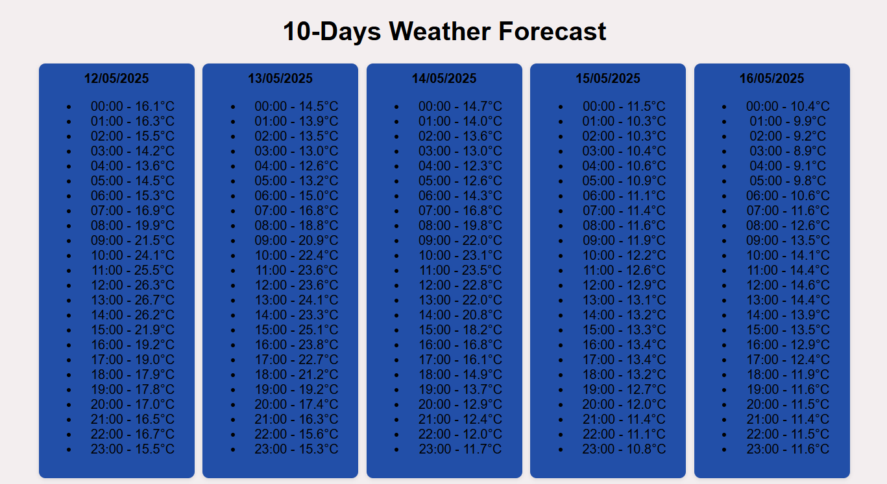
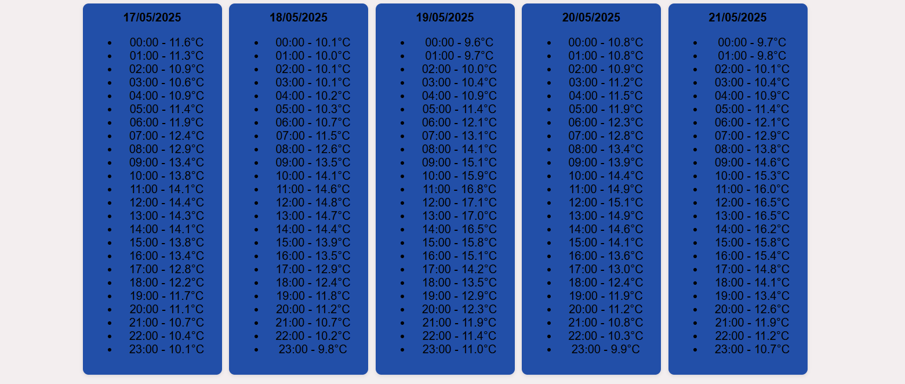
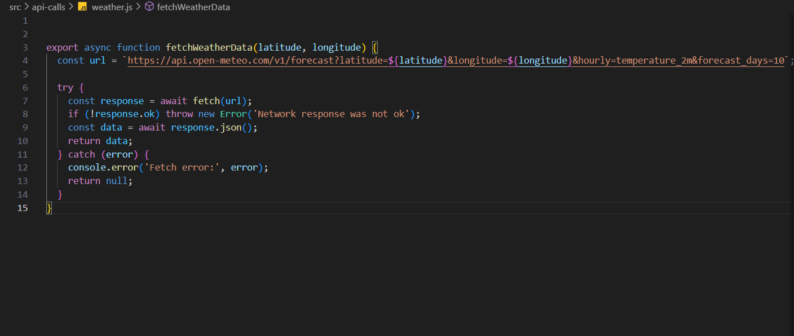

# Meteo

> The **Meteo** project uses the Open-Meteo API to provide 10-day hourly weather forecasts (e.g., temperature) for any location. It is a lightweight weather forecast tool with a clean and responsive user interface that displays weather data in an easy-to-understand format.

- [Meteo](#meteo)
  - [General info](#general-info)
  - [Screenshots](#screenshots)
  - [Code Example](#code-example)
  - [Technologies](#technologies)
  - [Status](#status)
  - [Inspiration](#inspiration)
  - [Contact](#contact)

## General info

> This project fulfills a practical need for accessible weather forecasts, displaying 10-day hourly temperature data for any geographical location. It leverages the Open-Meteo API and is ideal for developers learning about APIs, modular JavaScript, and responsive design.

## Screenshots

## Code Example

## Technologies

- HTML
- CSS
- JavaScript (ES Modules)
- Open-Meteo API
- Git & GitHub
- VS Code (Editor)

## Status

Project has Completed

## Inspiration

Project for my Brussels formation Course of FED in HYF

## Contact

[Sajid Hussain](https://github.com/SajidHussainabbasi)

