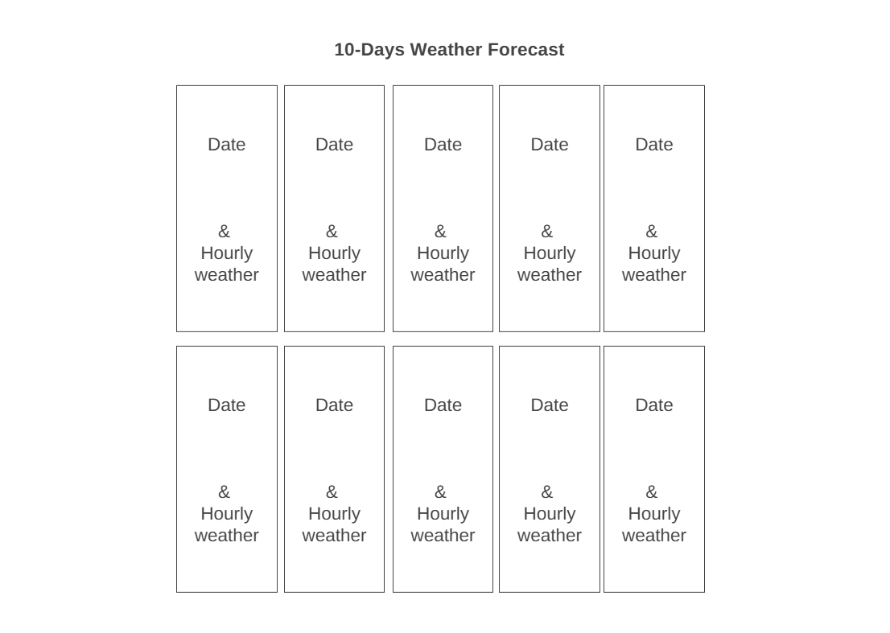

# Design

## Project's Design Overview

The **Meteo** app provides a clean, informative, and responsive user interface to display 10-day hourly weather forecasts using the [Open-Meteo API](https://open-meteo.com/). The app presents weather data grouped by day, each with a list of hourly temperature readings, allowing users to plan ahead based on precise forecast information.

- **Simple, Card-Based Layout**: Each day’s forecast is displayed in its own weather card, showing the date and hourly temperatures.
- **Responsive Grid**: Cards adjust automatically to screen sizes using CSS Grid.
- **Modular & Maintainable**: The app follows a modular architecture with separated logic (API calls, rendering, event listeners).
- **User-Centered Design**: Focus on clarity, readability, and accessibility for users on desktop or mobile.

---

## Wireframe(s)

Below is a conceptual layout of the Meteo app interface:

##  Key Features

1. **10-Day Forecast**: Retrieves and displays hourly temperature forecasts for 10 days.
2. **Daily Weather Cards**: Each day is visually grouped with its date and 24-hour temperature breakdown.
3. **Formatted Time & Temperature**: Hours shown in 24-hour format with temperatures rounded to 1 decimal.
4. **Centered Layout**: Titles and dates are centered for readability.
5. **Error Handling**: If data is unavailable, the app provides user feedback.
6. **Scalable Structure**: Code is organized for easy maintenance and feature expansion.

---

## Technologies Used

- **HTML**: Structures the layout and elements of the app.
- **CSS**: Styles the grid layout, cards, and text.
- **JavaScript (ES Modules)**: Handles data fetching, logic, and UI rendering.
- **Open-Meteo API**: Provides hourly temperature forecasts with flexible parameters.

---

##  Future Enhancements

- **User Input for Location**: Allow users to select or enter coordinates.
- **Additional Weather Data**: Include precipitation, humidity, or wind speed.
- **Unit Toggle**: Add support to switch between Celsius and Fahrenheit.
- **Forecast Charts**: Display hourly data visually using charts (e.g., temperature trends).
- **Dark Mode**: Offer light/dark theme toggle for improved accessibility.